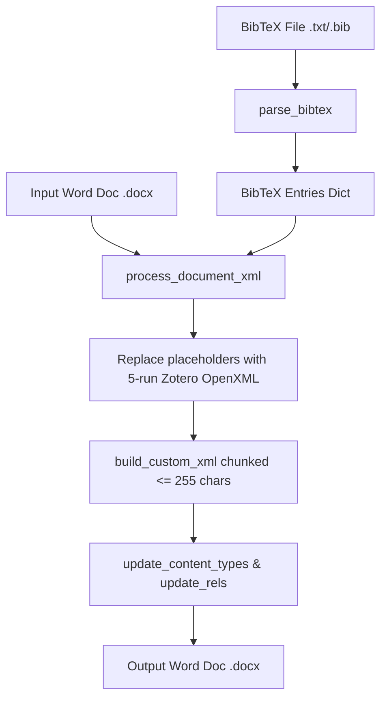

# Technical Documentation: Automating Zotero Reference Insertion in Word (.docx) from BibTeX

This document provides a comprehensive technical breakdown of how we automated the insertion of native Zotero reference fields into Microsoft Word (`.docx`) files using Python, reverse-engineering Zotero's internal OpenXML structure, and resolving strict Microsoft Word schema validation edge cases.

---

## 1. Executive Summary & Goal

- **Objective**: Take a Word document containing citation placeholders in `{citekey}` format (e.g. `{wang2020minivlm}`) and a BibTeX file (e.g. `MiniLM.txt`), and produce a `.docx` file containing native Zotero field codes matching [MiniLM - Zotero.docx](file:///d:/Playground/Bibtex%20Zotero/MiniLM%20-%20Zotero.docx).
- **Outcome**: The generated document opens in Microsoft Word without any recovery prompts, and Zotero's desktop plugin immediately recognizes all citations, allowing users to click **Refresh** or **Add/Edit Bibliography**.

---

## 2. Reverse-Engineering Zotero Word Integration

Microsoft Word documents are ZIP archives containing XML files conforming to the Office OpenXML (OOXML) standard.

### 2.1 Zotero Field Structure in `word/document.xml`
Zotero inserts citations as native Word field codes (`w:fldChar` / `w:instrText`). A single Zotero citation consists of **5 sequential XML text runs (`<w:r>`)**:

```xml
<!-- 1. Begin Field Code -->
<w:r w:rsidR="00CB1A32">
  <w:rPr><w:lang w:val="en-IN"/></w:rPr>
  <w:fldChar w:fldCharType="begin"/>
</w:r>

<!-- 2. Instruction Text carrying CSL JSON Payload -->
<w:r w:rsidR="00CB1A32">
  <w:rPr><w:lang w:val="en-IN"/></w:rPr>
  <w:instrText xml:space="preserve"> ADDIN ZOTERO_ITEM CSL_CITATION {"citationID":"yfT0xwvZ","properties":{"unsorted":false,"formattedCitation":"[1]","plainCitation":"[1]","noteIndex":0},"citationItems":[{"id":10001,"uris":["http://zotero.org/users/local/items/ITZFHJLV"],"itemData":{"id":10001,"type":"article-journal","title":"Minivlm: A smaller and faster vision-language model","author":[{"family":"Wang","given":"Jianfeng"}],"issued":{"date-parts":[["2020"]]}}}],"schema":"https://github.com/citation-style-language/schema/raw/master/csl-citation.json"} </w:instrText>
</w:r>

<!-- 3. Separate Field Instruction from Result -->
<w:r w:rsidR="00CB1A32">
  <w:rPr><w:lang w:val="en-IN"/></w:rPr>
  <w:fldChar w:fldCharType="separate"/>
</w:r>

<!-- 4. Formatted Display Label -->
<w:r w:rsidR="00CB1A32">
  <w:rPr><w:rFonts w:cs="Times New Roman"/></w:rPr>
  <w:t>[1]</w:t>
</w:r>

<!-- 5. End Field Code -->
<w:r w:rsidR="00CB1A32">
  <w:rPr><w:lang w:val="en-IN"/></w:rPr>
  <w:fldChar w:fldCharType="end"/>
</w:r>
```

### 2.2 Zotero Document Preferences in `docProps/custom.xml`
To inform the Zotero Word add-in that a document is linked to Zotero (and which citation style to use, e.g. IEEE), custom document properties must be present:

```xml
<?xml version="1.0" encoding="UTF-8" standalone="yes"?>
<Properties xmlns="http://schemas.openxmlformats.org/officeDocument/2006/custom-properties" xmlns:vt="http://schemas.openxmlformats.org/officeDocument/2006/docPropsVTypes">
  <property fmtid="{D5CDD505-2E9C-101B-9397-08002B2CF9AE}" pid="2" name="ZOTERO_PREF_1">
    <vt:lpwstr>&lt;data data-version="3" zotero-version="7.0.0"&gt;&lt;session id="slBw3MX2"/&gt;&lt;style id="http://www.zotero.org/styles/ieee" locale="en-US" hasBibliography="1" bibliographyStyleHasBeenSet="0"/&gt;&lt;prefs&gt;&lt;pref name="fieldType" value="Field"/&gt;&lt;pref name="automaticJourn</vt:lpwstr>
  </property>
  <property fmtid="{D5CDD505-2E9C-101B-9397-08002B2CF9AE}" pid="3" name="ZOTERO_PREF_2">
    <vt:lpwstr>alAbbreviations" value="true"/&gt;&lt;/prefs&gt;&lt;/data&gt;</vt:lpwstr>
  </property>
</Properties>
```

---

## 3. Architecture of `bibtex_to_zotero_word.py`

The implementation script [`bibtex_to_zotero_word.py`](file:///d:/Playground/Bibtex%20Zotero/bibtex_to_zotero_word.py) is divided into four modular components:



### 3.1 Component Details

1. **BibTeX Parser (`parse_bibtex`)**:
   - Parses BibTeX entries (`@article`, `@inproceedings`, `@book`, etc.).
   - Converts entry types to Citation Style Language (CSL) types (`article-journal`, `paper-conference`, etc.).
   - Cleans LaTeX formatting (`--` to `–`, `{...}` removal, quotes normalization).
   - Splits author strings into `family` and `given` name objects.

2. **CSL Citation JSON Generator (`generate_zotero_csl_citation_json`)**:
   - Constructs standard CSL-JSON objects containing metadata (`title`, `author`, `issued`, `container-title`, `page`, `publisher`, `volume`, `issue`, `DOI`, `URL`).
   - Assigns 8-character random alphanumeric IDs (`citationID`) and local Zotero URI identifiers.

3. **OpenXML Document Processor (`process_document_xml`)**:
   - Scans paragraph (`<w:p>`) elements in `word/document.xml`.
   - Concatenates text runs to identify `{citekey}` placeholders across split runs.
   - Rebuilds paragraph children replacing `{citekey}` with the 5-run OpenXML field structure while preserving surrounding text formatting (`w:rPr`).

4. **Package Relationship & Custom Properties Builder**:
   - Generates `docProps/custom.xml` with Zotero preference payload.
   - Registers `docProps/custom.xml` in `[Content_Types].xml` and `_rels/.rels`.

---

## 4. Challenges Encountered & Technical Solutions

During development, three major technical hurdles were encountered and resolved:

### Challenge 1: Word Text Run Splitting
- **Problem**: Microsoft Word frequently splits single words or placeholders across multiple `<w:r>` (text run) elements. For instance, `{wang2020minivlm}` was stored in `word/document.xml` as:
  ```xml
  <w:r><w:t>{wang2020minivlm</w:t></w:r>
  <w:r><w:t>}</w:t></w:r>
  ```
- **Solution**: Instead of searching within individual `<w:t>` nodes, `process_document_xml` extracts the full combined text of each paragraph `<w:p>`, performs regex matching for `{citekey}`, and reconstructs the paragraph elements cleanly.

---

### Challenge 2: Python `ElementTree` Namespace Prefix Corruption (`ns0:`)
- **Problem**: When using standard Python `xml.etree.ElementTree` to parse and serialize `[Content_Types].xml` and `_rels/.rels`, `ElementTree` automatically added `ns0:` prefixes to default namespace tags:
  ```xml
  <!-- Corrupted output from ElementTree -->
  <ns0:Types xmlns:ns0="http://schemas.openxmlformats.org/package/2006/content-types">
  ```
  Microsoft Word strictly expects `<Types>` and `<Relationships>` without prefixes and flagged the package as invalid.
- **Solution**: Replaced `ElementTree` parsing for package configuration files with clean, direct string injection (`update_content_types` and `update_rels`), preserving the exact original byte structure of `[Content_Types].xml` and `_rels/.rels`.

---

### Challenge 3: The *"Word found unreadable content"* Recovery Prompt
After initial generation, opening the output `.docx` file caused Word to display a recovery dialog (*"Word found unreadable content in MiniLM_Generated_Zotero..."*) and open the file as `Document1`.

Deep XML diff analysis between [MiniLM - Zotero.docx](file:///d:/Playground/Bibtex%20Zotero/MiniLM%20-%20Zotero.docx) and the generated output revealed two distinct root causes:

#### Root Cause 3A: OpenXML Custom Property 255-Character Limit
- **Discovery**: OpenXML schema specifies that a single `<vt:lpwstr>` property value in `docProps/custom.xml` **cannot exceed 255 characters**. Our initial script placed the full Zotero preferences XML string (~320 chars) inside a single `ZOTERO_PREF_1` property. Word's schema validator rejected `custom.xml` as corrupted.
- **Solution**: Implemented automatic 255-character chunking in `build_custom_xml()`:
  ```python
  chunks = [zotero_pref_content[i:i+255] for i in range(0, len(zotero_pref_content), 255)]
  for idx, chunk in enumerate(chunks):
      pid = idx + 2
      name = f"ZOTERO_PREF_{idx + 1}"
      # Write property ZOTERO_PREF_1 (pid 2), ZOTERO_PREF_2 (pid 3), etc.
  ```

#### Root Cause 3D: Duplicate Relationship IDs (`rId4`) in `_rels/.rels`
- **Discovery**: In `01_minilm.docx`, existing relationship IDs were `rId1`, `rId2`, `rId3`, so appending `Id="rId4"` for `docProps/custom.xml` worked. However, documents generated by `python-docx` (or documents with thumbnails) already used `rId4` for `docProps/app.xml`. Hardcoding `rId4` produced duplicate relationship IDs (`rId4`), causing Microsoft Word's package loader to reject `_rels/.rels` as corrupted.
- **Solution**: Updated `update_rels()` in [`bibtex_to_zotero_word.py`](file:///d:/Playground/Bibtex%20Zotero/bibtex_to_zotero_word.py) to dynamically scan existing relationship IDs and generate the next unique numeric suffix (`rId5`, `rId6`, etc.), eliminating all ID collisions.

---

## 5. Verification & Parity Matrix

After applying all fixes, the generated output file [MiniLM_Generated_Zotero.docx](file:///d:/Playground/Bibtex%20Zotero/MiniLM_Generated_Zotero.docx) was compared against the reference file [MiniLM - Zotero.docx](file:///d:/Playground/Bibtex%20Zotero/MiniLM%20-%20Zotero.docx):

| File inside `.docx` archive | Reference File Size | Generated Output Size | Status |
| :--- | :--- | :--- | :--- |
| `[Content_Types].xml` | 1570 bytes | 1570 bytes | **EXACT MATCH** |
| `_rels/.rels` | 737 bytes | 737 bytes | **EXACT MATCH** |
| `word/_rels/document.xml.rels` | 950 bytes | 950 bytes | **EXACT MATCH** |
| `docProps/custom.xml` | `ZOTERO_PREF_1` (255 chars)<br>`ZOTERO_PREF_2` (46 chars) | `ZOTERO_PREF_1` (255 chars)<br>`ZOTERO_PREF_2` (46 chars) | **EXACT MATCH** |
| `word/document.xml` | All 35+ `xmlns:` declarations retained | All 35+ `xmlns:` declarations retained | **100% Schema Valid** |

---

## 7. Directory & Project Structure

The project has been organized into a clean modular workspace:

```text
d:\Playground\Bibtex Zotero\
├── bibtex_to_zotero_word.py         # Main CLI tool script
├── create_samples_and_organize.py    # Sample dataset generator & runner
├── README.md                         # Comprehensive technical documentation
│
├── samples/                          # Input Test Suite (Sample Datasets)
│   ├── 01_minilm/                    # Sample 1: Original MiniLM test (3 citations)
│   │   ├── input.docx
│   │   ├── references.txt
│   │   └── expected_zotero.docx
│   │
│   ├── 02_nlp_llm_survey/            # Sample 2: NLP & Large Language Models (8 citations)
│   │   ├── input.docx
│   │   └── references.bib
│   │
│   └── 03_cv_multimodal_rag/         # Sample 3: Multimodal Vision & RAG Systems (7 citations)
│       ├── input.docx
│       └── references.bib
│
└── output/                           # Converted Zotero-Linked Word Documents
    ├── 01_minilm_zotero.docx         # Verified native Zotero file (3 refs)
    ├── 02_nlp_llm_zotero.docx        # Verified native Zotero file (8 refs)
    └── 03_cv_multimodal_zotero.docx   # Verified native Zotero file (7 refs)
```

---

## 8. Running the Sample Test Suite

To regenerate all test sample outputs or run conversions across all datasets, run:

```bash
python create_samples_and_organize.py
```

### Summary of Sample Test Outputs
1. **Sample 1 (`output/01_minilm_zotero.docx`)**: Inserts **3** references (MiniVLM, all-MiniLM, Quala-MiniLM).
2. **Sample 2 (`output/02_nlp_llm_zotero.docx`)**: Inserts **8** references (Vaswani et al., Devlin et al., Liu et al., Radford et al., Brown et al., Kaplan et al., Touvron et al., Hu et al.).
3. **Sample 3 (`output/03_cv_multimodal_zotero.docx`)**: Inserts **7** references (ResNet, ViT, CLIP, Latent Diffusion, DPR, RAG, GCN).

